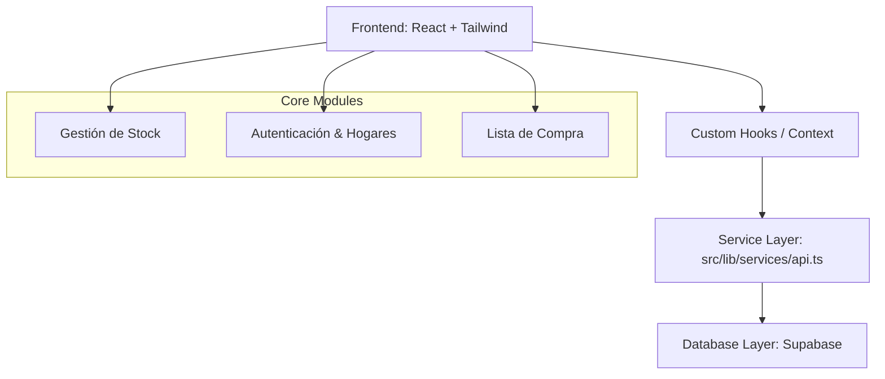

# AXON - El Sistema Operativo Familiar

AXON es una plataforma inteligente de gestión del hogar diseñada para centralizar el inventario, la logística familiar y la comunicación en un único punto de verdad.

## 🏗️ Arquitectura del Sistema (v3.0 Professional)

El proyecto sigue una arquitectura desacoplada basada en capas, cumpliendo con estándares de ingeniería de software para asegurar la escalabilidad y mantenibilidad.



### Capas Principales:
1.  **Capa de Presentación (Frontend):** React + Shadcn UI para una experiencia premium.
2.  **Capa de Servicio (Logic):** Centralizada en `src/lib/services/api.ts`. Ningún componente debe llamar directamente a Supabase.
3.  **Capa de Datos (Backend):** Supabase (Postgres) con políticas de RLS para aislamiento de hogares.

---

## 🚀 Despliegue Rápido

### Prerrequisitos
- Node.js (v18+)
- Cuenta de Supabase

### Instalación Local
```bash
git clone https://github.com/SrLobo-Aprendiz/AXON.git
cd AXON
npm install
npm run dev
```

---

## 🛠️ Tecnologías
- **Vite** (Build Tool)
- **TypeScript** (Tipado estricto)
- **React** (Componentes)
- **Shadcn UI** (Componentes visuales premium)
- **Tailwind CSS** (Estilos rápidos)
- **Supabase** (Backend-as-a-Service)

---

## 📈 Roadmap de Ingeniería
- [x] Implementación de Capa de Servicio (api.ts).
- [x] Optimización "Lite Mode" para dispositivos de gama media (OPPO A72).
- [ ] Refactorización de "God Components" a sub-componentes especializados.
- [ ] Implementación de RLS avanzada basada en roles (Owner/Member).

---

## 🤝 Contribución
Consulta nuestro archivo [CONTRIBUTING.md](CONTRIBUTING.md) para conocer las normas de estilo y el flujo de trabajo de programación en pareja con IA.
